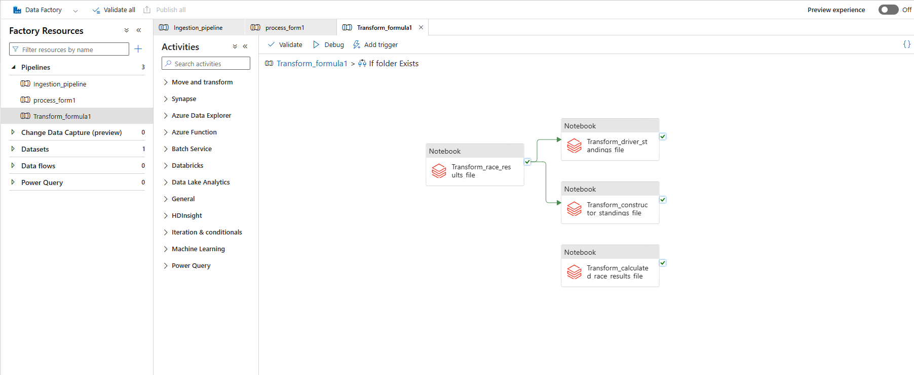
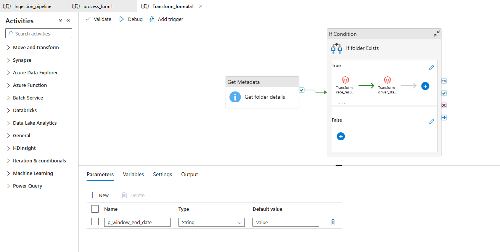
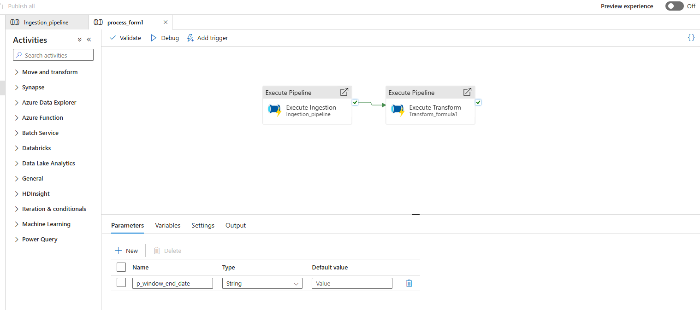

# Azure-Formula-1
# 🏎️ Formula 1 Data Engineering Pipeline on Azure

An **end-to-end data pipeline** built on Microsoft Azure to ingest, clean, and transform **Formula 1 race data**.  
This project demonstrates modern data engineering practices using **ADLS Gen2**, **Azure Databricks**, **Azure Data Factory (ADF)**, **Azure Key Vault**, and **Service Principals** for secure and automated data flow.

---

## 🚀 Project Overview

This project simulates a Formula 1 analytics data platform using Azure cloud services.  
It covers the entire data flow — from raw data storage to transformation — with proper security, automation, and monitoring.
## ScreenShots

---

## 🧱 Architecture Overview

## 🧩 Key Azure Components

| Component | Purpose |
|------------|----------|
| **Azure Data Lake Storage Gen2 (ADLS Gen2)** | Hierarchical storage for data lifecycle (`raw`, `ingest`, `transform`) |
| **Azure Databricks** | Data cleaning, transformation, and processing using notebooks |
| **Azure Key Vault** | Securely store secrets (Service Principal credentials) |
| **Service Principal (Azure AD App)** | Authenticate Databricks and Pipelines to access ADLS securely |
| **Azure Data Factory (ADF)** | Orchestrate ingest and transform pipelines |
| **Azure Storage Explorer** | Manage and upload files for testing |

---

## ⚙️ Implementation Steps

### 1️⃣ Create Azure Resources
- Resource Group  
- ADLS Gen2 (with hierarchical namespace enabled)  
- Azure Databricks Workspace  
- Azure Key Vault  
- Azure Data Factory  

---

### 2️⃣ Setup ADLS Gen2 Containers
Created three containers to organize the data flow:

---

### 3️⃣ Configure Service Principal + Key Vault
- Registered an **Azure AD App** and created a **Service Principal**.  
- Granted **Storage Blob Data Contributor** role for the storage account.  
- Stored credentials (`client-id`, `tenant-id`, `client-secret`) inside **Key Vault**.  

---

### 4️⃣ Connect Databricks with ADLS Gen2
- Created a **Databricks Secret Scope** backed by Key Vault.  
- Used secrets to mount ADLS Gen2 storage securely.  
---
### 5️⃣ Data Cleaning & Processing in Databricks

- Created multiple **Databricks notebooks** to clean, preprocess, and transform Formula 1 datasets.  
- Connected to ADLS Gen2 using the mounted paths (`/mnt/f1-raw`, `/mnt/f1-ingest`, `/mnt/f1-transform`).  
- Implemented data validation, handling missing values, and removing duplicates.  
- Transformed data into optimized **Parquet format** for faster querying.  
- Used **Spark DataFrames** for scalable data transformations.  
- Wrote cleaned and processed data back to the `transform` container for further analytics and reporting.
---
### 6️⃣ Build Azure Data Factory Pipelines

- Designed two main pipelines in Azure Data Factory:
- Ingest Pipeline → Loads data from raw → ingest.
- Transform Pipeline → Triggers Databricks notebooks for cleaning and transformation.
- Configured pipeline dependencies so that the transform pipeline executes only after a successful ingest.
- Added “If Condition” and “Get Metadata” activities for handling file-not-found errors gracefully.
- Connected ADF pipelines to:
   - Linked Services for ADLS Gen2 and Databricks workspace.
   - Databricks clusters for executing notebooks directly from ADF.
- Enabled logging, retries, and fail conditions for better fault tolerance.
### ADF Pipeline Flow:
  - Get Metadata → If File Exists → Copy Data (Raw → Ingest) → Trigger Databricks Notebook

---

### 7️⃣ Testing & Validation

- Uploaded sample Formula 1 CSV datasets using Azure Storage Explorer to the raw container.
- Ran ADF pipelines manually and verified successful data ingestion and transformation.
- Validated file outputs across all stages:
   - raw → Original source files
   - ingest → Clean intermediate copies
   - transform → Final processed and structured data
- Verified mount points and data visibility inside Databricks workspaces.
- Tested error scenarios like missing files to ensure pipelines handle them without failure.
---
## 🧠 Highlights & Learnings

- Implemented secure data connectivity using Service Principal and Azure Key Vault integration.
- Ensured end-to-end automation of data movement using ADF pipelines.
- Achieved modular and scalable design by separating raw, ingest, and transform zones.
- Integrated Databricks and ADF for seamless orchestration of Spark-based data transformations.
- Added error handling for file-not-found cases to make pipelines resilient.
- Used Azure Storage Explorer to simplify file management during testing and development.
- Built a foundation for analytics that can easily extend to Power BI or ML pipelines.
